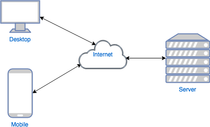
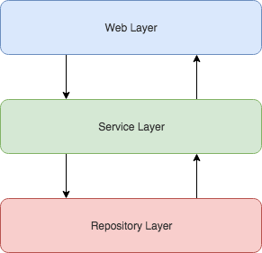
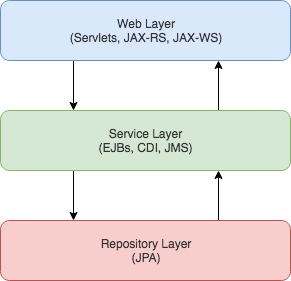

# Client - Server applications. Introduction to Java EE. 

## Client-Server architecture
* distributed software model
* server provides services
* client requests the services
* usually hosted on separate hardware (in the cloud)
* generally client can become server and vice versa

## Server
* shares resources and awaits client request
* most of logic resides on server
* usually handles more than one client

## Client
* requests services from server
* usually initiates communication
* need to communicate on protocol server understands
* client do not concern about the processing on server

## Client - Server communication
* usually request/response messaging pattern (not a rule)
* client sends request for resource/service, server returns response
* client and server communicate on well known protocol (e.g HTTP)

## Application Architecture 
* there a few architecture patterns for web applications
* it's always about reponsibility separation
* application architecture should be extensible and maintanable
* layered architecture, clean architecture, hexagonal architecture,...

## Typical Web Application Architecture
* usually follows layered architecture pattern
* there are typically 3 main layers
   * Web - provides public application API/interface 
   * Service - contains business logic
   * Repository - bridge between persistence storage and application
* good architecture should follow business needs of application, and should not be about current architect assigned to the project

## Java Enterprise Edition (EE) - What's this about?
* Standardization of enterprise/web components

> "Java EE is a platform which defines 'standard specifications/APIs' which are then implemented by vendors and used for development of enterprise (distributed, 'multi*tired', robust) 'applications'.
> These applications are composed of modules or 'components' which use Java EE 'containers' as their run*time infrastructure."

* vendor independent, however Java EE lead is (was?) Oracle
* community proven
* defined by experts in the field
* Latest version EE 7 (Jul 2013, defined by JSR 342)
* Glassfish 4 - reference implementation for Java EE 7
* Java EE 8 (JSR 366) almost finished (hopefully to the end of 2017)

## Java EE profiles
* There are two profiles of Java EE
  * Web Profile
  * Full Profile

### Web Profile
Web profile complaint application servers are:
 * Glassfish 4.1+
 * Wildfly 8+
 * Apache TomEE 7+, however not certified support

The following technologies are required components of the Web Profile:
*  Servlet 3.1
*  JavaServer Pages (JSP) 2.3
*  Expression Language (EL) 3.0
*  Debugging Support for Other Languages (JSR*45) 1.0
*  Standard Tag Library for JavaServer Pages (JSTL) 1.2
*  JavaServer Faces (JSF) 2.2
*  Java API for RESTful Web Services (JAX*RS) 2.0
*  Java API for WebSocket (WebSocket) 1.0
*  Java API for JSON Processing (JSON*P) 1.0
*  Common Annotations for the Java Platform (JSR*250) 1.2
*  Enterprise JavaBeans (EJB) 3.2 Lite
*  Java Transaction API (JTA) 1.2
*  Java Persistence API (JPA) 2.1
*  Bean Validation 1.1
*  Managed Beans 1.0
*  Interceptors 1.2

## Full Profile
Full Profile complaint application servers are:
  * Glassfish 4.1+
  * Wildfly 8+
  * Oracle WebLogic Server 12.2.1+
  * JBoss Enteprise Application Platform 7.0+
  * IBM WebSphere Application Server 9.0+

The following technologies are required components of Full Profile:
*  EJB 3.2 
*  Servlet 3.1
*  JSP 2.3
*  EL 3.0
*  JMS 2.0
*  JTA 1.2
*  JavaMail 1.5
*  Connector 1.7
*  Web Services 1.4
*  JAX*WS 2.2
*  JAX*RS 2.0
*  WebSocket 1.0
*  JSON-P 1.0
*  Concurrency Utilities 1.0
*  Batch 1.0
*  JAXB 2.2
*  Java EE Management 1.1
*  JACC 1.5
*  JASPIC 1.1
*  JSP Debugging 1.0
*  JSTL 1.2
*  Web Services Metadata 2.1
*  JSF 2.2
*  Common Annotations 1.2
*  Java Persistence 2.1
*  Bean Validation 1.1
*  Managed Beans 1.0
*  Interceptors 1.2
*  Contexts and Dependency Injection for Java EE 1.1
*  Dependency Injection for Java 1.0

## Java EE 8
* brings few new APIs
* JSON-B 1.0
* Security 1.0
* Servlet 4.0 with focus on HTTP/2
* CDI 2.0

## Typical Web Application Architecture with Java EE
* each part of Java EE standard has its place in the application architecture
* for basic web application is web profile just enough

