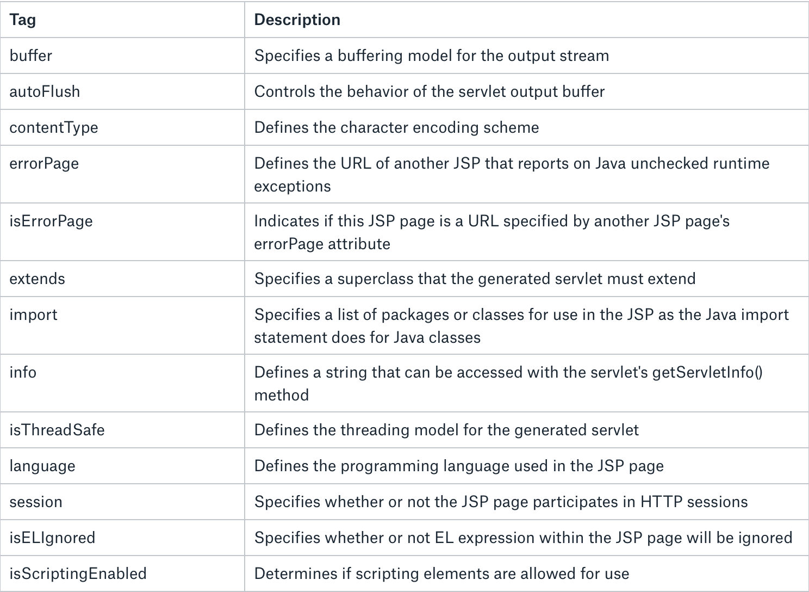
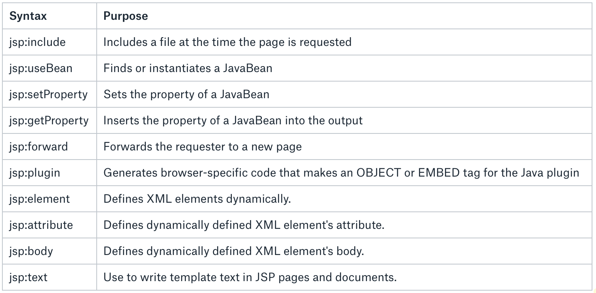

# User interface  - JSP, jSF

## What is JSP
- adds dynamic content to web pages
- JSP 2.2 (JSR 340)
## How JSP works
- the request from client is directed to JSP engine
- engine identifies JSP page and converts it into servlet
- the servlet produces HTML and send it to client via response
- the servlet is converted from JSP once (not considered JSP page change)
## JSP lifecycle
- compilation, initialization,execution,cleanup
- jspInit() and jspDestroy() can be overriden


## JSP Scripting elements
- comment  `<%-- This is comment--%>` 
- directive `<%@ directive %>` 
- declaration  `<%!`declarations %>` 
- scriptlet `<% scriptlet %>` 
- expression `<%= expression  =>` 


## JSP Sciptlet Tag
- `<% java code %>` 
- allows to write java code in JSP page
```
       <html>
         <head>
            <meta http-equiv="Content-Type" content="text/html; charset=UTF-8">
            <title>Welcome Page</title>
        </head>
       <%
          // Retrieve user parameter
          String user = request.getParameter("user");
       %>
      <body>
            Hello, <% out.println(user); %>
      </body>
    </html>
```

## JSP Declaration Tag
- `<%! declaration %>` 
- variables declared in declaration tag are declared as Servlet class members
- static member,instance variable and methods inside
```
    <html>
        <head>
            <title>My First JSP Page</title>
        </head>
       <%! int count = 0; %>
      <body></body>
    </html>
    
    // translates into ->
    public class hello_jsp extends HttpServlet
    {
      int count=0;
      public void _jspService(HttpServletRequest request, HttpServletResponse response) 
                                   throws IOException,ServletException
        {
          PrintWriter out = response.getWriter();
          response.setContenType("text/html");
          out.write("<html><body>");
          out.write("</body></html>");
       }
    }
```

## JSP Directive Tag
- `<%@ page attribute="value" %>` 
- provide directions and instructions to the container, telling it how to handle certain aspects of JSP processing
- **page,include, taglib**


## JSP Directives -  @page 
- gives special instruction to Web Container at the time of page translation



## JSP Directives - @include 
- `<%@ include file="relative_url" %>` 
- the container merge the content of other external file with the current JSP during the translation phase
- could be anywhere in page
```
    <%@ include file="header.jsp" %>
    <div>
    <p>Thanks for visiting my page.</p>
    </div>
    <%@ include file="footer.jsp" %>
```


## JSP Directives - @taglib


- `<%@ taglib uri="uri" prefix="prefixOfTag" >` 
- declares that your JSP page uses a set of custom tags, identifies the location of the library, 
and provides a means for identifying the custom tags in your JSP page
```
    <%@ taglib uri="http://www.example.com/custlib" prefix="mytag" %>
    <html>
    <body>
    <mytag:hello/>
    </body>
    </html>
```


## JSP Actions
- XML syntax to control the behavior of the servlet engine



## JSP Expression Language
- EL makes it possible to easily access the data in JavaBeans
- allows expressions both (a) arithmetic and (b) logical
- the EL can be placed anywhere in JSP page
- EL contains some implicit objects
```
    <jsp:setProperty name="box" value="${config.value}"/>
```

                 

## JSP Expression Language - functions
- allows to use functions
- functions must be defined in custom tag libraries
```
    <--! Part of JSTL library -->
    ${ns:length("Some text")} 
```

### JSP - typical architecture

- MVC pattern
- servlet process request and executes logic
- redirects to JSP which displays the view


Other template engines
- Thymeleaf
- Freemarker
- Handlebars
- Velocity

## What is JSF (JavaServer Faces)?
- Component base UI framework standardized in Java EE
- Defined by JSR 372 
- Uses Facelets template system
- There are many ready to use JSF component libraries
  - http://richfaces.jboss.org/
  - https://www.primefaces.org/
  - http://www.icesoft.org/java/home.jsf
### Facelets
- Template engine designed for JSF
- It replaced JSP, which was used for JSF 1.x
```
       <?xml version='1.0' encoding='UTF-8' ?>
        <!DOCTYPE html
            PUBLIC "-//W3C//DTD XHTML 1.0 Transitional//EN"
         "http://www.w3.org/TR/xhtml1/DTD/xhtml1-transitional.dtd">
    <html xmlns="http://www.w3.org/1999/xhtml" xmlns:h="http://xmlns.jcp.org/jsf/html">
    <h:head>
     <title>My Facelet Page Title</title>
    </h:head>
    <h:body>
      Hello from Facelets
    </h:body>
    </html>
```

- Facelets provides Expression Language (EL) integration. This allows two-way data binding between the backing beans and the UI:
    Hello from Facelets, my name is #{name.value}!

Common  Facelets tags

| Syntax         | Description                                                                                                                                                                                                                                                               |
| -------------- | ------------------------------------------------------------------------------------------------------------------------------------------------------------------------------------------------------------------------------------------------------------------------- |
| ui:composition | Defines a page layout that optionally uses a template. If the template attribute is used, the children of this tag define the template layout. If not, it’s just a group of elements—a composition—that can be inserted anywhere. Content outside of this tag is ignored. |
| ui:insert      | Used in a template page and defines the placeholder for inserting content into a template. A matching ui:define tag in the template client page replaces the content.                                                                                                     |
| ui:define      | Used in a template client page; defines content that replaces the content defined in a template with a matching ui:insert tag.                                                                                                                                            |
| ui:component   | Inserts a new UI component into the JSF component tree. Any component or content fragment outside this tag is ignored.                                                                                                                                                    |
| ui:fragment    | Similar to ui:component, but does not disregard content outside this tag.                                                                                                                                                                                                 |
| ui:include     | ncludes the document pointed to by the src attribute as part of the current Facelets page.                                                                                                                                                                                |

Source: Java EE 7 Essentials

Navigation Rules
- JSF defines implicit and explicit navigation rules

Implicit
```
    <h:commandButton action="note" value="Show Note"/>
```
Explicit
```
<navigation-rule>
    <from-view-id>index.xhtml</from-view-id>
    <navigation-case>
        <from-outcome>note</from-outcome>
        <to-view-id>note.xhtml</to-view-id>
    </navigation-case>
    <from-view-id>note.xhtml</from-view-id>
    <navigation-case>
    <from-outcome>index</from-outcome>
    <to-view-id>index.xhtml</to-view-id>
    </navigation-case>
</navigation-rule>
```